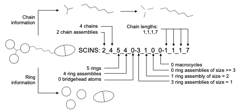

# SCINS

Code to accompany the preprint: https://chemrxiv.org/engage/chemrxiv/article-details/66b40b2e01103d79c51dc457.

## Contents
1. [What is SCINS?](#what-is-scins)
2. [Installation and setup](#install)
3. [Notes](#important-note)

## What is SCINS?



The SCINS descriptor. The SCaffold Identification and Naming System (SCINS) (Schueffenhauer et al., J. Chem. Inf. Model., 2007, Clustering and Rule-Based Classifications of Chemical Structures Evaluated in the Biological Activity Space) is a descriptor of the reduced generic scaffold and is represented by a string in the format A_B_C_D_E-F_G_H_I-J_K_L_M where each letter is the value of one of the following 12 numerical descriptors:

A. Number of Chain Assemblies. Chain assemblies are contiguous linkers between ring assemblies. They are uncovered by removing all ring bonds in the molecule.

B. Number of Chains. Chains are all unbranched linkers needed to cover all non-ring bonds in the molecule.

C. Number of Rings.

D. Number of Ring Assemblies. Ring assemblies are fragments remaining when all acyclic bonds have been removed.

E. Number of Bridge Atoms. 

F. Number of Ring Assemblies Consisting of Exactly One Ring.

G. Number of Ring Assemblies Consisting of Exactly Two Rings.

H. Number of Ring Assemblies Consisting of Three or More Rings.

I. Number of Macrocycles. Rings constituting more than 12 atoms are considered macrocyclic.

J. Binned Length of Shortest Chain.

K. Binned Length of Second Shortest Chain.

L. Binned Length of Third Shortest Chain.

M. Binned Length of Fourth Shortest Chain.

| Chain Length |  0 (No chain) | 1 | 2 | 3, 4 | 5, 6 | ≥ 7 |
| :---: |  :---: | :---: | :---: | :---: | :---: | :---: |
| Binned Length | 0 | 1 | 2 | 3 | 4 | 7 |


## Install

Clone and install the package:

`git clone git@github.com:PangeAI/SCINS.git`

`cd SCINS`

`make build_env`

or if you already have an environment with all the requirements:

`make install`

To run the tests:

`make test`

For details on how to use SCINS, check the notebook: `example/SCINS_example_usage.ipynb`. However, briefly, you can try:

```python
from rdkit import Chem
from rdkit.Chem.Scaffolds.MurckoScaffold import GetScaffoldForMol, MakeScaffoldGeneric
from scins import scins

mol = Chem.MolFromSmiles('Cc1cc(C)nc(SCC(=O)Nc2ncc(Cc3ccccc3)s2)n1')
scaffold = GetScaffoldForMol(mol)
generic_scaffold = MakeScaffoldGeneric(scaffold)

# or instead "trim" the carbonyls by (see notes below):
scaffold = scins.GetScaffoldForMol_edited(mol)
generic_scaffold = MakeScaffoldGeneric(scaffold)

scins = scins.generic_scaffold_mol_to_scins(generic_scaffold)
```

## Important Note

It is essential that you apply the function on
the generic scaffold. Otherwise, the result would not be what is intended.

For more practical examples of how to apply SCINS, please check `example/SCINS_example_usage.ipynb`.

## Second Important Note

In the following example, notice how the carbonyl oxygen lead to a "separate chain".


In case you want to avoid keeping the carbonyls as side chains in the generic scaffold use the following.
Remember that compounds with hypervalent atoms (like hexavalent sulfur or pentavalent phosphorus will fail this step).
To handle those use the provided `scins.GetScaffoldForMol_edited` function first and then apply `MakeScaffoldGeneric` to the result.

```python
mol = Chem.MolFromSmiles(smiles)
generic_scaffold = MakeScaffoldGeneric(mol)
generic_scaffold = GetScaffoldForMol(generic_scaffold)
scins_str = scins.generic_scaffold_mol_to_scins(generic_scaffold)
```

Originally, I proposed using an edited version of the function in rdkit (below), but if you'd rather relying on rdkit for the task of getting the scaffold, 
I think the above is better - essentially making the molecule generic first avoids complications due to bond orders.

```python
scaffold = scins.GetScaffoldForMol_edited(mol)
generic_scaffold = MakeScaffoldGeneric(scaffold)
scins_str = scins.generic_scaffold_mol_to_scins(generic_scaffold)
```
For the same molecule, the function GetScaffoldForMol_edited in the 
package trims the carbonyl oxygen (and other bits that are sticking out).


