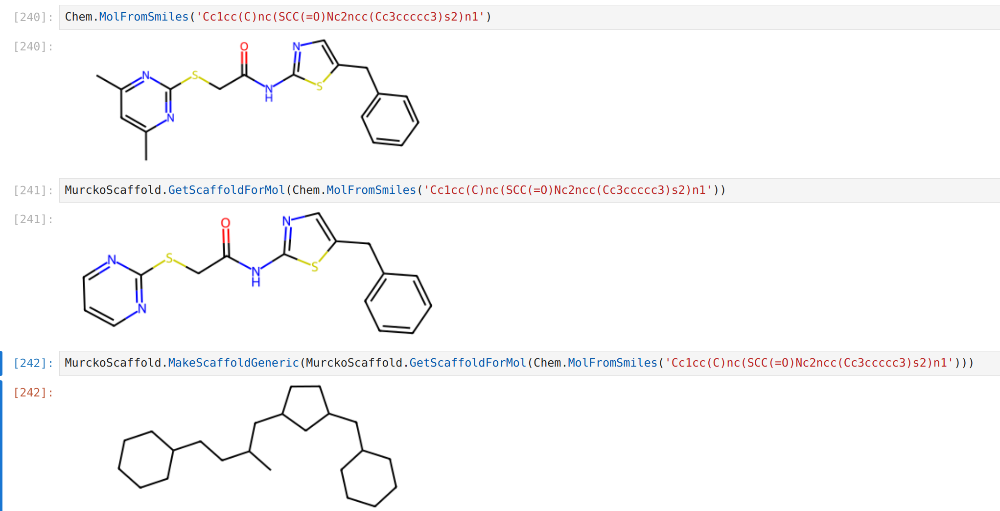
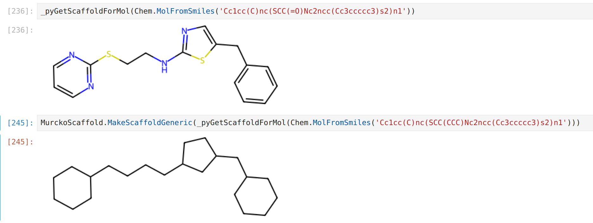

# SCINS

## Intended usage

Clone and install the package:

`git clone git@github.com:PangeAI/SCINS.git`

`cd SCINS`

`pip install -e scins`

In your script (although probably the version below is better):

```python
from rdkit import Chem
from rdkit.Chem.Scaffolds.MurckoScaffold import GetScaffoldForMol, MakeScaffoldGeneric
import scins

mol = Chem.MolFromSmiles('Cc1cc(C)nc(SCC(=O)Nc2ncc(Cc3ccccc3)s2)n1')
scaffold = GetScaffoldForMol(mol)
generic_scaffold = MakeScaffoldGeneric(scaffold)
scins_str = scins.scaffold_mol_to_scins(mol)
```

## Important Note:

It is essential that you apply the function on
the generic scaffold. Otherwise, the result would not be meaningful.

## Second Important Note:

A slightly weird behaviour was observed with the code above even though
it is does implement what was described in the original paper. 
In the following example, notice how the carbonyl oxygen lead to a "separate chain". 
This does not correspond to my chemical intuition.



The following code snippet shows a way to avoid this issue:

```python
mol = Chem.MolFromSmiles(smiles)
generic_scaffold = MakeScaffoldGeneric(mol)
generic_scaffold = GetScaffoldForMol(generic_scaffold)
scins_str = scins.generic_scaffold_mol_to_scins(generic_scaffold)
```

Originally, I proposed using an edited version of the function in rdkit (below), but because it is not tested well, 
I think the above is better - essentially making things generic first avoids complications due to bond orders.

```python
scaffold = scins.GetScaffoldForMol_edited(mol)
generic_scaffold = MakeScaffoldGeneric(scaffold)
scins_str = scins.generic_scaffold_mol_to_scins(generic_scaffold)
```
For the same molecule, the function GetScaffoldForMol_edited in the 
package trims the carbonyl oxygen (and other bits that are sticking out).
Therefore, this definition of the scaffold harmonates with my notions of the world.



However, this function has not been tested thoroughly, so apply at your own risk.
